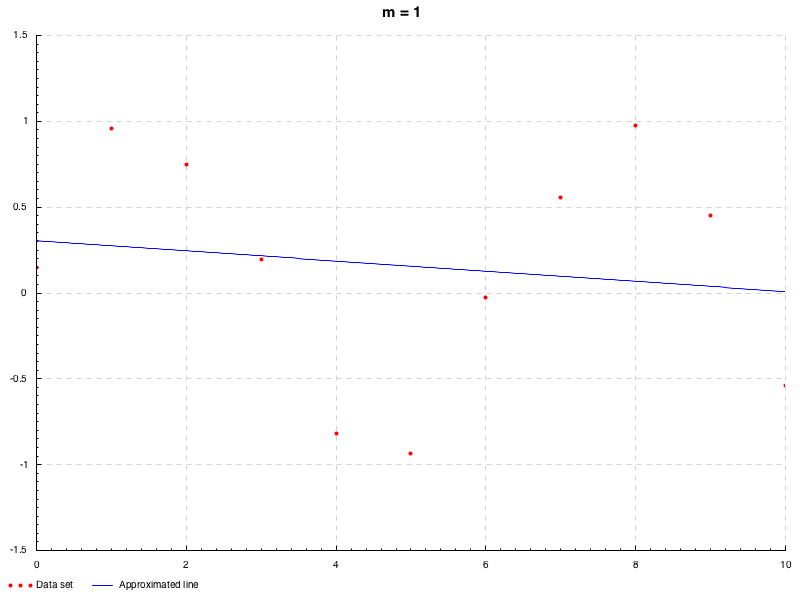

# PlayLinearAlgebra

[](https://travis-ci.org/falgon/PlayLinearAlgebra)
[](LICENSE)

My playground about linear algebra.

## Build

```sh
$ stack build
```

## Apps

Includes a least squares plotter.
It works by solving by LU decomposition and solving by pseudo inverse matrix respectively.

### `lineqByLU`,`lineqByPseudo`

```sh
$ stack exec lineqByLU
Usage: lineqByLU <dta file path> <output image path> <degree number>
$ stack exec lineqByLU -- range.dta out.png 9 # https://math.arizona.edu/~dsl/brange.htm
```

When executed as above, the following figure will be output.


The same result can be obtained by executing lineqByPseudo in the same way.

### `lineqRegular`

`lineqRegular` performs L2 regularization according to arbitrary parameters.

```sh
$ stack exec lineqRegular
Usage: lineqRegular <dta file path> <output image path> <parameter>
$ stack exec lineqRegular -- rats.dta out.png 1 # https://math.arizona.edu/~dsl/brats.htm
```

When executed as above, the following figure will be output.


### `mkAnimFromDta`

`mkAnimFromDta` outputs git animation that
can see transitions of fitting by model from 1 to the specified dimension.
In order to do this imagemagick must be set up under the execution environment.

```sh
$ stack exec mkAnimFromDta
Usage: mkAnimFromDta <dta file path> <output image path> <degree number>
$ stack exec mkAnimFromDta -- range.dta out.gif 10
```

When executed as above, the following figure will be output.


### `mkAnimFromSamples`

`mkAnimFromSamples` outputs a gif animation that can see the fitting transitions for

with a degree specified from 1.
Note that  
is noise that follows the normal distribution of 
.

```sh
$ stack exec mkAnimFromSamples
Usage: mkAnimFromSamples <output image path> <degree number>
$ stack exec mkAnimFromSamples -- out.gif 8
```

When executed as above, the following figure will be output.


